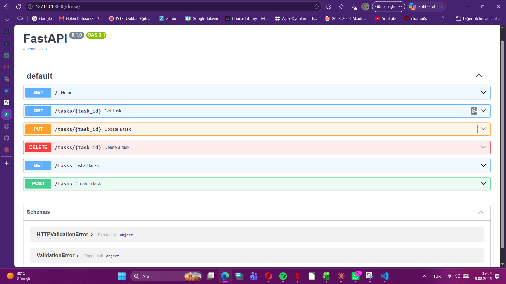

# Task API

A simple CRUD API built with Python and FastAPI.

## How to Run

```bash
uvicorn main:app --reload
```

## Endpoints

| Method | Endpoint | Description |
|---|---|---|
| GET | /tasks | List all tasks |
| GET | /tasks/{task_id} | Get one task |
| POST | /tasks | Create a task |
| PUT | /tasks/{task_id} | Update a task |
| DELETE | /tasks/{task_id} | Delete a task |

## Swagger UI

Open:

http://127.0.0.1:8000/docs



## Example curl

```text
HTTP/1.1 200 OK
date: Sat, 08 Aug 2026 16:12:48 GMT
server: uvicorn
content-length: 174
content-type: application/json

[{"id":1,"title":"Final sınavına çalış","done":false},{"id":2,"title":"FlyRank projesini tamamla","done":false},{"id":3,"title":"GitHub reposunu güncelle","done":true}]
```
